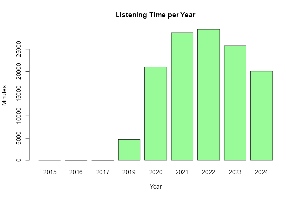
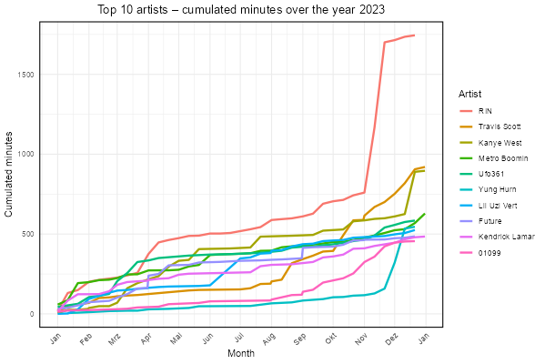
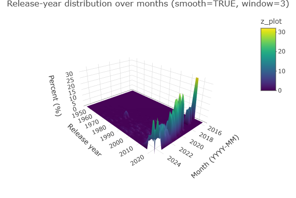
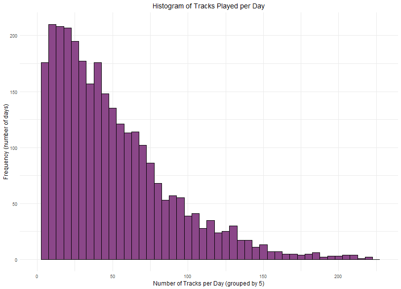
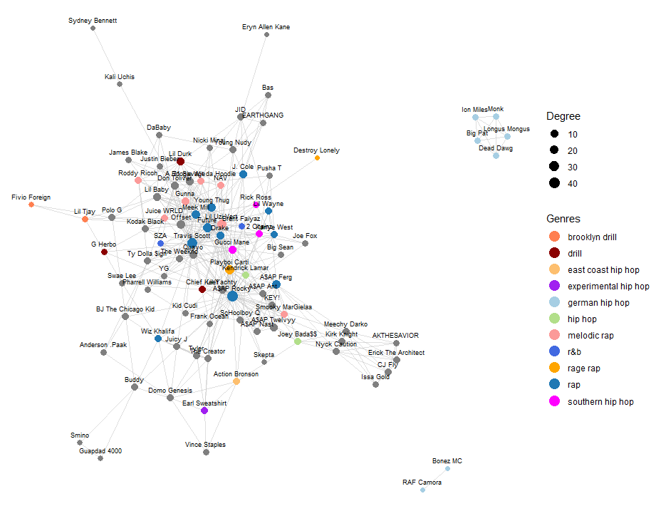

# Analysis of Spotify all time history with R

Request your Spotify extended streaming history (from [here](https://www.spotify.com/us/account/privacy/)) and take a look at your favorite songs, albums etc.

It is recommended to begin with `getting_started.r`. This will guide you through the process of importing your data and settings up the API connection (optional) and you can try out the functions (from the `Functions` folder).

You can also directly upload your .json files and get an overview here: <https://lebot.shinyapps.io/spotify/>

## Ideas

-   World map showing from which country/IP-address you have connected in the past
-   Additions? Feel free to contribute

